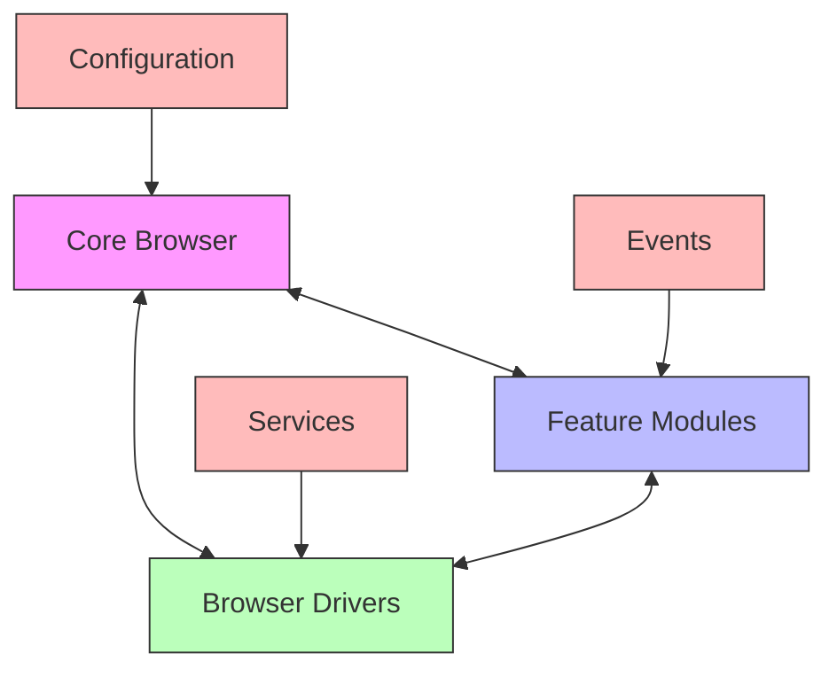

# Stable Chrome Puppet - Refactoring Plan

## Overview

This document outlines the refactoring strategy for transforming the monolithic Chrome browser implementation into a modular, maintainable, and extensible architecture. The plan addresses current limitations while establishing a solid foundation for future development.

## Table of Contents

1. [Current Architecture Analysis](#1-current-architecture-analysis)
2. [Proposed Architecture](#2-proposed-architecture)
3. [Implementation Roadmap](#3-implementation-roadmap)
4. [Configuration System](#4-configuration-system)
5. [Feature Modules](#5-feature-modules)
6. [Testing Strategy](#6-testing-strategy)
7. [Documentation](#7-documentation)
8. [Implementation Status](#8-implementation-status)
9. [Contribution Guidelines](#9-contribution-guidelines)

## 1. Current Architecture Analysis

### 1.1 Current Limitations

* Monolithic `ChromeBrowser` class with too many responsibilities
* Tight coupling between browser functionality and Chrome-specific implementation
* Limited test coverage
* Hard-coded configuration values
* Inconsistent error handling
* Lack of proper documentation

### 1.2 Goals

* Improve code organization and maintainability
* Increase test coverage
* Make the code more modular and extensible
* Improve documentation
* Make it easier to add new features
* Improve error handling and logging

## 2. Proposed Architecture

### 2.1 High-Level Overview



### 2.2 Core Components

* **Core Browser**: Handles basic browser lifecycle and setup
* **Feature Modules**: Independent, pluggable features
* **Browser Drivers**: Browser-specific implementations
* **Configuration**: Centralized configuration management
* **Events**: Event system for communication between components
* **Services**: Shared services and utilities

### 2.3 Project Structure

```text
core/
  browser/
    __init__.py             # Package exports
    base.py                 # Base browser implementation
    interfaces.py           # Core interfaces
    
    features/             # Feature modules (mixins)
      __init__.py
      navigation.py        # Page navigation
      tabs.py              # Tab management
      elements.py          # Element interaction
      cookies.py           # Cookie handling
      alerts.py            # Alert dialogs
      windows.py           # Window management
      javascript.py        # JavaScript execution
      
    drivers/              # Browser implementations
      __init__.py
      chrome/
        __init__.py
        browser.py        # Main Chrome browser class
        options.py        # Chrome options builder
        service.py        # Chrome service manager
        
    config/              # Configuration
      __init__.py
      base.py
      chrome.py
      
    utils/               # Shared utilities
      __init__.py
      decorators.py
      exceptions.py
      validators.py
```

## 3. Implementation Roadmap

### 3.1 Phase 1: Core Restructuring (Week 1)

* Set up project structure
* Create base browser interfaces
* Implement core browser functionality
* Set up configuration system
* Implement basic logging
* Set up testing infrastructure

### 3.2 Phase 2: Feature Extraction (Week 2)

* Extract navigation features
* Extract element interaction features
* Extract JavaScript execution features
* Extract alert handling
* Extract storage management
* Extract window/tab management
* Extract network features module

### 3.3 Phase 3: Testing and Documentation (Week 3)

* Write unit tests for all components
* Add integration tests
* Update documentation
* Create examples
* Performance testing
* Final review and cleanup

## 4. Configuration System

### 4.1 Configuration Structure

```python
class BrowserConfig:
    """Base configuration for browser instances."""
    def __init__(self, **kwargs):
        self.headless = kwargs.get('headless', False)
        self.window_size = kwargs.get('window_size', (1280, 800))
        # ... other common options ...

class ChromeConfig(BrowserConfig):
    """Chrome-specific configuration."""
    def __init__(self, **kwargs):
        super().__init__(**kwargs)
        self.chrome_binary = kwargs.get('chrome_binary')
        # ... chrome-specific options ...
```

### 4.2 Implementation Tasks

* Implement base configuration
* Add Chrome-specific configuration
* Implement configuration validation
* Add environment variable support

## 5. Feature Modules

### 5.1 Module Structure

```text
features/
  __init__.py
  element/               # Element interaction
    base.py
    finders.py
    actions.py
    wait.py
  navigation/            # Navigation
    history.py
    waiter.py
  network/               # Network interception
    request.py
    response.py
    interceptor.py
  storage/               # Storage management
    cookies.py
    local_storage.py
```

### 5.2 Implementation Tasks

* Extract element interaction logic
* Refactor navigation features
* Implement network interception
* Add storage management

## 6. Testing Strategy

### 6.1 Test Structure

```text
tests/
  unit/
    browser/
    drivers/
    features/
  integration/
    browser/
    features/
  fixtures/            # Test fixtures
  utils/               # Test utilities
```

### 6.2 Implementation Tasks

* Add unit tests for core components
* Add integration tests for Chrome driver
* Implement test fixtures
* Add CI/CD pipeline

## 7. Documentation

### 7.1 Documentation Structure

```text
docs/
  getting_started.md
  api/
    browser.md
    configuration.md
    drivers/
      chrome.md
  examples/
    basic_usage.py
    configuration.py
```

### 7.2 Implementation Tasks

* Update API documentation
* Add usage examples
* Create migration guide

## 8. Implementation Status

### 8.1 Completed

* Core browser interfaces
* Base browser implementation
* Factory system
* Basic Chrome driver structure

### 8.2 In Progress

* Chrome driver implementation
* Configuration system
* Test coverage

### 8.3 Pending

* Update documentation
* Create migration guide
* Performance testing
* Final review and cleanup

## 9. Contribution Guidelines

### 9.1 Development Workflow

1. **Fork** the repository
2. Create a **feature branch** for your changes
3. Make your changes following the coding standards
4. Add/update **tests** for your changes
5. Update **documentation** as needed
6. Submit a **pull request**

### 9.2 Coding Standards

- Follow **PEP 8** style guide
- Use **type hints** for all function signatures
- Write **docstrings** for all public methods and classes
- Keep commits **small and focused**
- Write **meaningful commit messages**

### 9.3 Testing Requirements

- All new features must include **unit tests**
- Complex features should include **integration tests**
- Maintain **test coverage** above 80%
- Run tests locally before submitting a PR

### 9.4 Code Review Process

- At least **one approval** required before merging
- Address all review comments
- Update documentation if needed
- Ensure all CI checks pass
class ChromeConfig(BrowserConfig):
    """Chrome-specific configuration."""
    def __init__(self, **kwargs):
        super().__init__(**kwargs)
        self.chrome_binary = kwargs.get('chrome_binary')
        # Chrome-specific options
```

### 4.2 Implementation Tasks
- [ ] Implement base configuration
- [ ] Add Chrome-specific configuration
- [ ] Implement configuration validation
- [ ] Add environment variable support

## 5. Feature Modules

### 5.1 Module Structure

```text
features/
  __init__.py
  element/               # Element interaction
    base.py
    finders.py
    actions.py
  navigation/            # Navigation
    history.py
    waiter.py
  network/               # Network interception
    request.py
    response.py
  storage/               # Storage management
    cookies.py
    local_storage.py
```

## 6. Testing Strategy

### 6.1 Test Structure

```text
tests/
  unit/
    test_browser.py
    test_factory.py
    test_config.py
  integration/
    test_chrome_driver.py
  conftest.py
  fixtures/
    browser.py
    config.py
```

### 6.2 Implementation Tasks
- [ ] Add unit tests for core components
- [ ] Add integration tests for Chrome driver
- [ ] Implement test fixtures
- [ ] Add CI/CD pipeline

## 7. Documentation

### 7.1 Documentation Structure

```text
docs/
  getting_started.md
  api/
    browser.md
    configuration.md
    drivers/
      chrome.md
  examples/
    basic_usage.py
    configuration.py
```

## Implementation Progress

### Completed
- [x] Core browser interfaces
- [x] Base browser implementation
- [x] Factory system
- [x] Basic Chrome driver structure

### In Progress
- [ ] Chrome driver implementation
- [ ] Configuration system
- [ ] Test coverage

## How to Contribute

1. Fork the repository
2. Create a feature branch
3. Make your changes
4. Add/update tests
5. Update documentation
6. Submit a pull request

## 2. Configuration Management

### 2.1 Configuration Structure

```text
config/
  __init__.py             # Configuration exports
  base.py                 # Base configuration classes
  browser.py              # Browser-specific config
  driver.py               # Driver configuration
  profiles/               # Browser profile management
    base.py
    chrome.py
```

### 2.2 Implementation Tasks
- [ ] Implement hierarchical configuration system
- [ ] Add configuration validation
- [ ] Support multiple configuration sources (env vars, files, etc.)
- [ ] Add profile management

## 3. Feature Modules

### 3.1 Module Structure

```text
features/
  __init__.py            # Feature exports
  element/               # Element interaction
    base.py
    finders.py
    actions.py
    wait.py
  navigation/            # Navigation
    history.py
    waiter.py
  network/               # Network interception
    request.py
    response.py
    interceptor.py
  storage/               # Storage management
    cookies.py
    local_storage.py
```

### 3.2 Implementation Tasks
- [ ] Extract element interaction logic
- [ ] Refactor navigation features
- [ ] Implement network interception
- [ ] Add storage management

## 4. Testing Strategy

### 4.1 Test Structure

```text
tests/
  unit/
    browser/
    drivers/
    features/
  integration/
    browser/
    features/
  fixtures/            # Test fixtures
  utils/               # Test utilities
  conftest.py          # Pytest configuration
```

### 4.2 Testing Tasks
- [ ] Add unit tests for core functionality
- [ ] Implement integration tests
- [ ] Add browser automation tests
- [ ] Set up test coverage reporting

## 5. Documentation

### 5.1 Documentation Structure
- API Reference
- User Guide
- Development Guide
- Examples

### 5.2 Documentation Tasks
- [ ] Document public API
- [ ] Create usage examples
- [ ] Add developer documentation
- [ ] Document configuration options

## Implementation Progress

### In Progress
- [ ] Refactoring Chrome driver architecture
- [ ] Implementing configuration system

### Completed
- [x] Initial project analysis
- [x] Created refactoring plan

## How to Contribute

1. **Pick an Issue**
   - Choose an unassigned task from the plan
   - Discuss implementation approach if needed

2. **Development**

   ```bash
   # Create feature branch
   git checkout -b feature/your-feature-name
   
   # Make changes
   # Add tests
   # Update documentation
   ```

3. **Submit Changes**
   ```bash
   # Run tests
   pytest
   
   # Format code
   black .
   
   # Create pull request
   git push origin feature/your-feature-name
   ```

4. **Code Review**
   - Address review comments
   - Update documentation if needed
   - Ensure all tests pass

## Notes
- Follow PEP 8 style guide
- Write meaningful commit messages
- Keep pull requests focused and small
- Update documentation when making changes
- Add tests for new features
